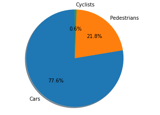
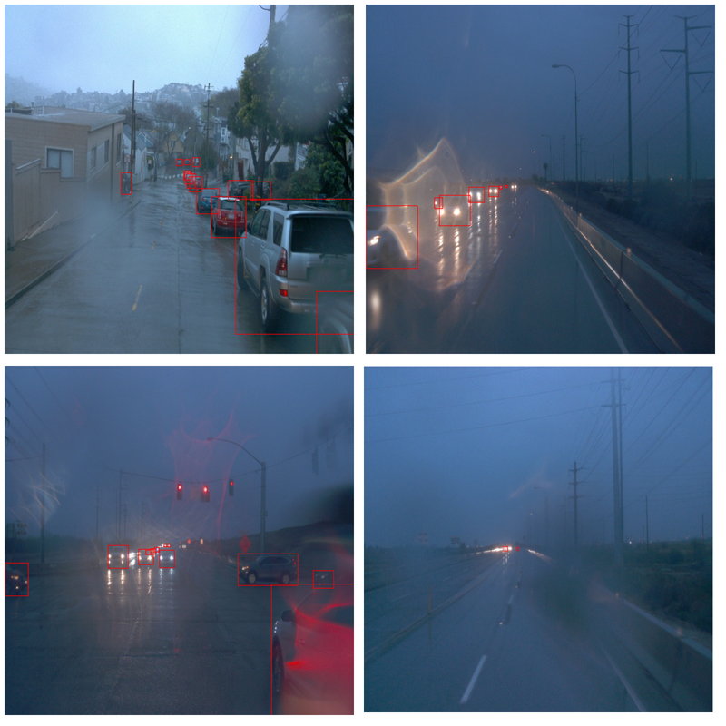
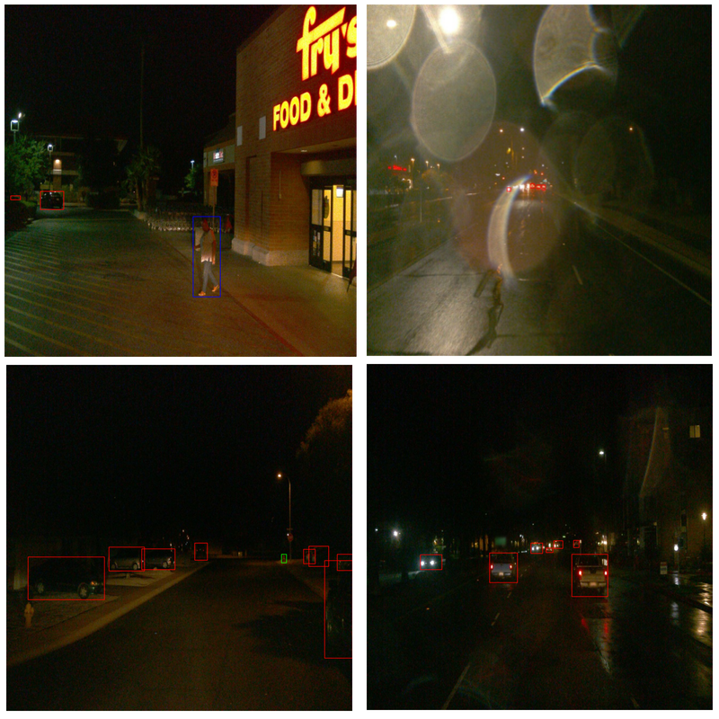
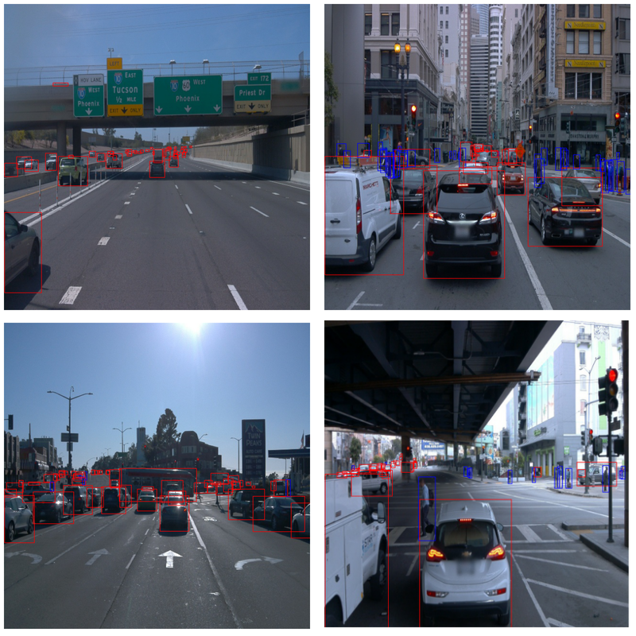
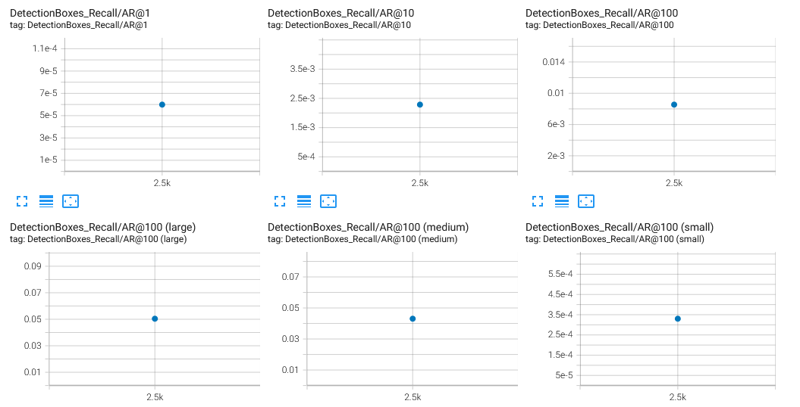
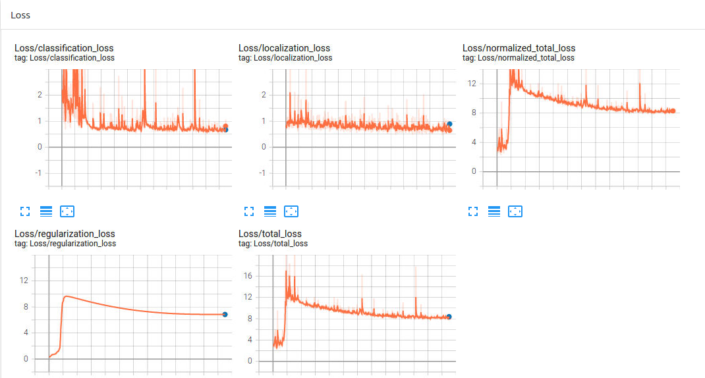
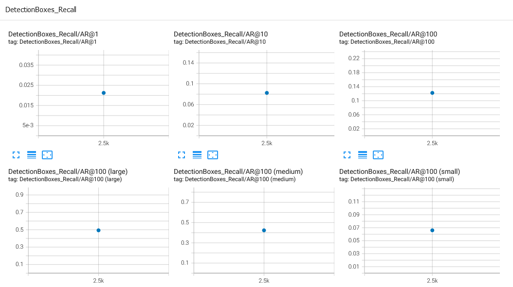

# Object Detection in an Urban Environment

## Data

For this project, we will be using data from the [Waymo Open dataset](https://waymo.com/open/).

[OPTIONAL] - The files can be downloaded directly from the website as tar files or from the [Google Cloud Bucket](https://console.cloud.google.com/storage/browser/waymo_open_dataset_v_1_2_0_individual_files/) as individual tf records. We have already provided the data required to finish this project in the workspace, so you don't need to download it separately.

## Structure

### Data

The data you will use for training, validation and testing is organized as follow:
```
/home/workspace/data/waymo
	- training_and_validation - contains 97 files to train and validate your models
    - train: contain the train data (empty to start)
    - val: contain the val data (empty to start)
    - test - contains 3 files to test your model and create inference videos
```
The `training_and_validation` folder contains file that have been downsampled: we have selected one every 10 frames from 10 fps videos. The `testing` folder contains frames from the 10 fps video without downsampling.
```
You will split this `training_and_validation` data into `train`, and `val` sets by completing and executing the `create_splits.py` file.


### Experiments
The experiments folder will be organized as follow:
```
experiments/
    - pretrained_model/
    - exporter_main_v2.py - to create an inference model
    - model_main_tf2.py - to launch training
    - reference/ - reference training with the unchanged config file
    - experiment0/ - create a new folder for each experiment you run
    - experiment1/ - create a new folder for each experiment you run
    - experiment2/ - create a new folder for each experiment you run
    - label_map.pbtxt
    ...
```

## Prerequisites

### Local Setup

For local setup if you have your own Nvidia GPU, you can use the provided Dockerfile and requirements in the [build directory](./build).

Follow [the README therein](./build/README.md) to create a docker container and install all prerequisites.

### Download and process the data

**Note:** ”If you are using the classroom workspace, we have already completed the steps in the section for you. You can find the downloaded and processed files within the `/home/workspace/data/preprocessed_data/` directory. Check this out then proceed to the **Exploratory Data Analysis** part.

The first goal of this project is to download the data from the Waymo's Google Cloud bucket to your local machine. For this project, we only need a subset of the data provided (for example, we do not need to use the Lidar data). Therefore, we are going to download and trim immediately each file. In `download_process.py`, you can view the `create_tf_example` function, which will perform this processing. This function takes the components of a Waymo Tf record and saves them in the Tf Object Detection api format. An example of such function is described [here](https://tensorflow-object-detection-api-tutorial.readthedocs.io/en/latest/training.html#create-tensorflow-records). We are already providing the `label_map.pbtxt` file.

You can run the script using the following command:
```
python download_process.py --data_dir {processed_file_location} --size {number of files you want to download}
```

You are downloading 100 files (unless you changed the `size` parameter) so be patient! Once the script is done, you can look inside your `data_dir` folder to see if the files have been downloaded and processed correctly.

### Classroom Workspace

In the classroom workspace, every library and package should already be installed in your environment. You will NOT need to make use of `gcloud` to download the images.

## Instructions

### Exploratory Data Analysis

You should use the data already present in `/home/workspace/data/waymo` directory to explore the dataset! This is the most important task of any machine learning project. To do so, open the `Exploratory Data Analysis` notebook. In this notebook, your first task will be to implement a `display_instances` function to display images and annotations using `matplotlib`. This should be very similar to the function you created during the course. Once you are done, feel free to spend more time exploring the data and report your findings. Report anything relevant about the dataset in the writeup.

Keep in mind that you should refer to this analysis to create the different spits (training, testing and validation).


### Create the training - validation splits
In the class, we talked about cross-validation and the importance of creating meaningful training and validation splits. For this project, you will have to create your own training and validation sets using the files located in `/home/workspace/data/waymo`. The `split` function in the `create_splits.py` file does the following:
* create three subfolders: `/home/workspace/data/train/`, `/home/workspace/data/val/`, and `/home/workspace/data/test/`
* split the tf records files between these three folders by symbolically linking the files from `/home/workspace/data/waymo/` to `/home/workspace/data/train/`, `/home/workspace/data/val/`, and `/home/workspace/data/test/`

Use the following command to run the script once your function is implemented:
```
python create_splits.py --data-dir /home/workspace/data
```

### Edit the config file

Now you are ready for training. As we explain during the course, the Tf Object Detection API relies on **config files**. The config that we will use for this project is `pipeline.config`, which is the config for a SSD Resnet 50 640x640 model. You can learn more about the Single Shot Detector [here](https://arxiv.org/pdf/1512.02325.pdf).

First, let's download the [pretrained model](http://download.tensorflow.org/models/object_detection/tf2/20200711/ssd_resnet50_v1_fpn_640x640_coco17_tpu-8.tar.gz) and move it to `/home/workspace/experiments/pretrained_model/`.

We need to edit the config files to change the location of the training and validation files, as well as the location of the label_map file, pretrained weights. We also need to adjust the batch size. To do so, run the following:
```
python edit_config.py --train_dir /home/workspace/data/train/ --eval_dir /home/workspace/data/val/ --batch_size 2 --checkpoint /home/workspace/experiments/pretrained_model/ssd_resnet50_v1_fpn_640x640_coco17_tpu-8/checkpoint/ckpt-0 --label_map /home/workspace/experiments/label_map.pbtxt
```
A new config file has been created, `pipeline_new.config`.

### Training

You will now launch your very first experiment with the Tensorflow object detection API. Move the `pipeline_new.config` to the `/home/workspace/experiments/reference` folder. Now launch the training process:
* a training process:
```
python experiments/model_main_tf2.py --model_dir=experiments/reference/ --pipeline_config_path=experiments/reference/pipeline_new.config
```
Once the training is finished, launch the evaluation process:
* an evaluation process:
```
python experiments/model_main_tf2.py --model_dir=experiments/reference/ --pipeline_config_path=experiments/reference/pipeline_new.config --checkpoint_dir=experiments/reference/
```

**Note**: Both processes will display some Tensorflow warnings, which can be ignored. You may have to kill the evaluation script manually using
`CTRL+C`.

To monitor the training, you can launch a tensorboard instance by running `python -m tensorboard.main --logdir experiments/reference/`. You will report your findings in the writeup.

### Improve the performances

Most likely, this initial experiment did not yield optimal results. However, you can make multiple changes to the config file to improve this model. One obvious change consists in improving the data augmentation strategy. The [`preprocessor.proto`](https://github.com/tensorflow/models/blob/master/research/object_detection/protos/preprocessor.proto) file contains the different data augmentation method available in the Tf Object Detection API. To help you visualize these augmentations, we are providing a notebook: `Explore augmentations.ipynb`. Using this notebook, try different data augmentation combinations and select the one you think is optimal for our dataset. Justify your choices in the writeup.

Keep in mind that the following are also available:
* experiment with the optimizer: type of optimizer, learning rate, scheduler etc
* experiment with the architecture. The Tf Object Detection API [model zoo](https://github.com/tensorflow/models/blob/master/research/object_detection/g3doc/tf2_detection_zoo.md) offers many architectures. Keep in mind that the `pipeline.config` file is unique for each architecture and you will have to edit it.

**Important:** If you are working on the workspace, your storage is limited. You may to delete the checkpoints files after each experiment. You should however keep the `tf.events` files located in the `train` and `eval` folder of your experiments. You can also keep the `saved_model` folder to create your videos.


### Creating an animation
#### Export the trained model
Modify the arguments of the following function to adjust it to your models:

```
python experiments/exporter_main_v2.py --input_type image_tensor --pipeline_config_path experiments/reference/pipeline_new.config --trained_checkpoint_dir experiments/reference/ --output_directory experiments/reference/exported/
```

This should create a new folder `experiments/reference/exported/saved_model`. You can read more about the Tensorflow SavedModel format [here](https://www.tensorflow.org/guide/saved_model).

Finally, you can create a video of your model's inferences for any tf record file. To do so, run the following command (modify it to your files):
```
python inference_video.py --labelmap_path label_map.pbtxt --model_path experiments/reference/exported/saved_model --tf_record_path /data/waymo/testing/segment-12200383401366682847_2552_140_2572_140_with_camera_labels.tfrecord --config_path experiments/reference/pipeline_new.config --output_path animation.gif


## Submission Template

### Project overview

The aim of the project is to train an Artificial Neural Network (ANN) to detect three classes of objects: cars, cyclists and pedestrians. The training data comes from the Waymo Open Dataset. Object detection is an important aspect of enabling self-driving cars to participate in road traffic. The identified data enables the car to omit collisions, identify and comply with traffic signs and traffic lights.   


### Dataset
#### Dataset analysis

As mentioned earlier, the dataset comes from the Waymo Open Dataset. It's the view of a front camera in a moving car recorded in various traffic, weather and lighting conditions. For the purpose of becoming familiar with the dataset an exploratory data analysis was conducted. Examples are found under the following link: [EDA](/Exploratory%20Data%20Analysis.ipynb). 

The training set contains 29710 car, 8355 pedestrian and 214 cyclist objects.


Example images with visible ground truth boxes can be seen below.

- examples of poor visibility due to rain, or fog. Water droplets are also present on the camera lense, which limits the visibility and distorts objects:
 


- examples during night time. Less light makes it more difficult to properly classify objects:



- examples of different types of four wheel vehicles that need to be indentified, some vehicles are also partially visible on the camera:


- examples of different traffic conditions - images from a highway and city traffic. A varying density of cars, pedestrians and cyclists is to be exepcted in such enviroments, as well as varying weather conditions. One of the images shows a very sunny day:



- other examples showing pedestrian crossings at different times of day and car traffic:


#### Cross validation

The dataset consists of 99 tfrecord files. The images were shuffled and divided into three groups: training, valiation and testing. After training is finished a validation process is performed in order to assess whether the model is overfitting. 


### Training
#### Reference experiment

Training and validation was performed for the reference model. 
The following results can be seen:
- average precision metrics:


- recall metrics:



- loss metrics: 



For the 2500 training steps it can be seen that the model is slighly overfitting the training data (the blue dot is the validation result, which is above the orange line representing the training data). For the reference model the following image augmentation options were used: random crop and random horizontal flip. 

Overall, it can be seen that the total loss is equal to the value 8.4, regularization loss: 6.83. The mean Average Precision (mAP) is equal to 0.0003101. The Recall values are also very small. These results are not good. This result can be improved by testing different augmentation options and optimizer options. However, another limiting factor in the training is the amount of available space in the workspace, therefore the training is limited to 2500 steps. 


#### Improve on the reference

Three experiments were conducted with different setting - for the optimizer as well as for the amount of image augmentations. A summary is shown below:


Examples of augmentations (change of saturnation, brightness and contrast) for experiment 0:


Examples of augmentations (augmentations of experiment 0 + "random_black_patches") for experiment 1 & 2:


Examples of augmentations can be seen also in the Jupyter notebook: 
[Explore augmentations](/Explore%20augmentations.ipynb)

The reference model was run several times, in one instance the total loss was growing at a very high rate with each iteration step and it did not converge. On another attempt high loss was visible at the beginning of the training. Therefore, the warmup learning rate was decreased to 0.002 and the 
learning rate base was set to 0.004. Since the model is overfitting additional augmentations were chosen to decrease the overfitting. 

 Additional image augmentations were added to each of the three models as can be seen in the above table. 
 
 For experiment0 a more basic set of augmentations was chosen. The momentum optimizer was used just as in the reference model, but to achieve better convergence the learning rate and warmup rate were decreased to 0.004 and 0.002 respectively. 

 The following results can be seen in TensorBoard: 
- average precision metrics:


- recall metrics:



- loss metrics: 


The results are an improvement over the reference model. The mAP improved from 0.0003101 to 0.078. Regularization loss:0.26, total loss: 1.02. It can be seen the model is also slightly overfitting. 

Another experiment was done to check if adding another type of augmentation would improve the overfitting results. A "random black patches" augmentation was added, which mimics the way water droplets can limit the camera view of the environment. The results were however worse than for experiment 0. The mAP was equal to: 0,00157, regularization loss: 0.73, total loss: 2.35. The model was also overfitting. 

The last experiment was done to check if the results might improve by picking another optimizer. For the same augmentations as for experiment1 a different optimizer was chosen. Instead of the momentum optimizer the learning is done using the adam optimizer. The results were even worse than in the case of experiment 1, mAP =6.44e-5, regularization loss: 1.08, total loss: 2.92. 
 
The experiments were finished with the conclusion that experiment0 gives the best results. For the limited amount of learning steps available it can be seen that adding further augmentations only worsens the results, the change of the optimizer similarly worsened the results.  

Experiment0 model was chosen to generate the animations for three test TF records. 

